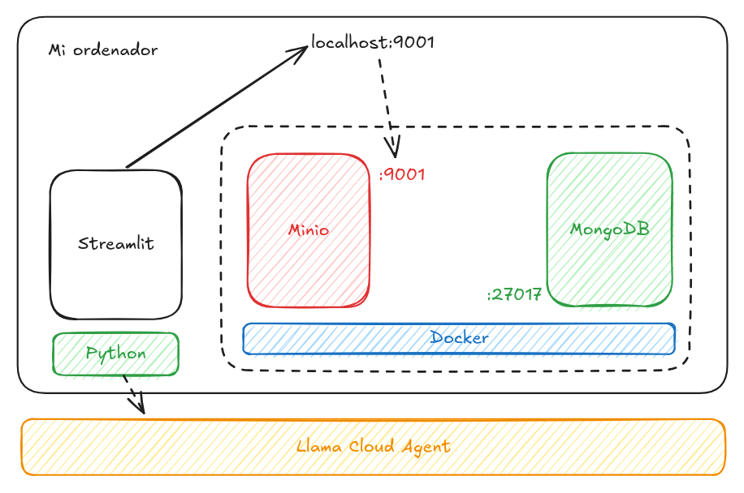

# Proyecto facturas

Aplicación de lectura de facturas. La plataforma está formada por un sistema de almacenamiento flexible (MinIO) y una base de datos documental (MongoDB).

## Plataforma

Para poder desarrollar puede levantarse la plataforma mediante `docker compose up`. Esto habilita además de la infraestructura base:

* La creación de un bucket `invoice`
* El acceso a localhost:9001 para minio
* El acceso a mongoDB express en localhost:8081 (admin:pass) para a gestión de las colecciones

Se debe copiar el fichero `.env.example` con las variables de entorno locales.



También hará falta disponer de un agente de extracción en LLama Cloud: https://cloud.llamaindex.ai/. Con el token de conexión a la API y el nombre del agente la aplicación se encarga de invocar el proceso de extracción de datos.

## Desarrollo

Existen dos grupos de dependencias adicionales que nos permiten realizar las demos de Streamlit.

```
uv sync --group demo
```

Y otro para las necesidades de desarrollo

```
uv sync --group dev
```

Podemos crear el entorno con todas las dependencias también.

```
uv sync --all-groups
```

Deberán pasarse los test unitarios antes de poder subir el código `uv run pytest`.

### Paquete base

El proyecto construye un paquete base llamado `facturas`. Este paquete contiene las funcionalidades base.

### Aplicación

Dispone de una app demo para validar el correcto funcionamiento de las funciones en este paquete. Es una aplicación que requiere autenticación y en base al nombre de usuario almacena la información cruda (factura) así como la información extraída (JSON).

